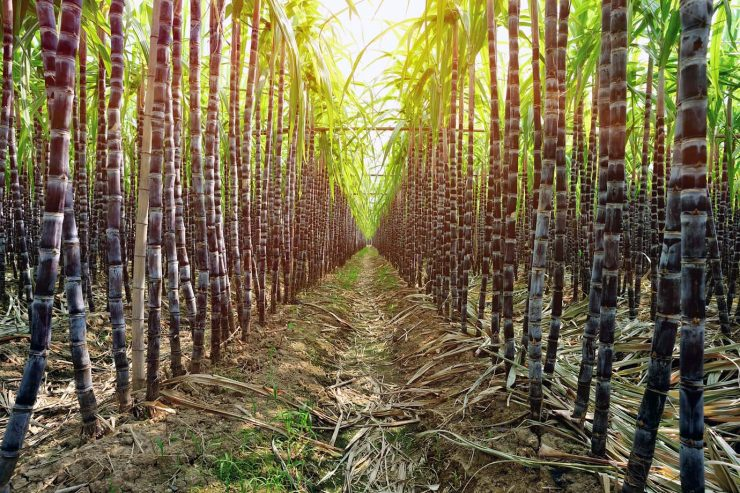

# FIAP - Inteligência Artificial
## Capítulo 1 - Play na sua carreira em IA

### Projeto: FarmTech Solutions

---

## 🌾 Culturas Escolhidas: Soja e Cana de Açúcar

| Soja                                                                                                                                                                                          | Cana de Açúcar                                                                                     |
|-----------------------------------------------------------------------------------------------------------------------------------------------------------------------------------------------|---------------------------------------------------------------------------------------------------|
| A soja é o principal produto da agricultura brasileira. O Brasil representa cerca de 50% do comércio mundial de soja.  E a região Centro-Oeste é a segunda maior produtora de soja do Brasil. | O Brasil é o maior exportador mundial de açúcar e esse produto gera bilhões de reais de receita.  |
|                                                                                                                              |                         |

### 🧪 Dados Técnicos utilizados nos cálculos:

#### Soja:
- **Figura geométrica usada**: Retângulo (Área = comprimento x largura)
- **Produto para o plantio**: Água
- **Requisito de água**: 620 litros por metro quadrado (620 l/m²)
- **Espaçamento entre plantas na linha**: 0,1m (10cm)
- **Espaçamento entre linhas**: 0,5m (50cm)

#### Cana de Açúcar:
- **Figura geométrica usada**: Retângulo (Área = comprimento x largura)
- **Produto para o plantio**: Nitrogênio
- **Dose recomendada**: 30 kg/hectare (equivalente a 0,3g/m²)
- **Rendimento de 0,3g/m²**: suficiente para 5,71 plantas
- **Plantas por metro linear**: 8
- **Espaçamento entre linhas**: 1,4m

### Exemplo de cálculo (Soja):
```python
# total_plants_per_m2 = 1 / (0.1 * 0.5) = 20 plantas/m²
# insumo total = área * total_plants_per_m2 * 620L
# insumo_total = área_em_m² * 20 * 620
```
> Ou seja, para cada metro quadrado de plantação de soja, serão necessários **12.400 litros de água**.
---

## 🐍 Aplicação em Python

A aplicação Python foi desenvolvida para coletar, calcular e armazenar os dados de lavouras de forma interativa.

### Funcionalidades:
- Inserção de dados de fazendas: tipo de cultura, área plantada (retângulo), nome da fazenda
- Cálculo da área em m²
- Cálculo de insumo necessário (água para soja, nitrogênio para cana)
- Atualização e remoção de registros existentes
- Exportação automática dos dados em formato `.csv` para a pasta `r_analysis`

### Estrutura modular:
- `main.py`: lógica principal, menu e interação com o usuário
- `farm.py`: classe `Farm` com cálculos de área e insumo
- `agriculture_type.py` e `product.py`: definem os tipos de culturas e produtos
- `operation.py`: enumeração para controlar as operações disponíveis no menu
- `exporter.py`: exporta os dados para o CSV
- `__init__.py`: torna os diretórios pacotes válidos em Python (organização do projeto)

## 📊 Módulo de Análise Estatística em R

Após a coleta e exportação dos dados pelo programa Python, foi desenvolvido um módulo em R para realizar análises estatísticas básicas por tipo de cultura.

### 🔧 Funcionalidades
- Leitura do arquivo `farm_data.csv` exportado pelo programa Python
- Transformação da variável `agriculture_type` em fator
- Cálculo das seguintes métricas por cultura:
  - Média e desvio padrão da **área plantada**
  - Média e desvio padrão do **insumo utilizado**
  - Densidade de insumo por metro quadrado (`quantity_product / area`)
  - Coeficiente de variação (CV = desvio padrão / média)

### 📈 Interpretação dos Resultados
Essas análises ajudam o agricultor a:
- Entender o perfil médio das fazendas por cultura
- Avaliar a variabilidade no uso de insumos (via desvio padrão e coeficiente de variação)
- Refletir sobre eficiência e consistência nas práticas agrícolas

### ⚠️ Limitações Importantes
- **Culturas diferentes usam insumos diferentes** (ex: soja usa água, cana usa nitrogênio)
- As análises agrupam por tipo de cultura — portanto, **os insumos não devem ser comparados diretamente entre culturas**
- Futuramente, o projeto pode ser expandido para incluir o tipo de insumo como coluna e permitir análises mais granulares

---

## 📁 Organização do Projeto

```bash
first-work/
│
├── source/                  # Código-fonte em Python
│   ├── __init__.py          # Identifica o diretório como pacote
│   ├── main.py              # Menu principal e execução
│   ├── farm.py              # Lógica de cálculos
│   ├── agriculture_type.py  # Tipos de culturas (enum)
│   ├── product.py           # Produtos e unidades de medida
│   ├── operation.py         # Enumeração de opções do menu
│   └── exporter.py          # Exportação de dados para CSV
│
├── r_analysis/              # Módulo de análise estatística em R
│   ├── farm_data.csv        # Dados exportados
│   └── analysis_script.R    # Análises estatísticas
│
└── README.md                # Documentação do projeto
```

## Referências:
1. Como estimar a produtividade na cultura da soja? : https://www.pioneer.com/br/blog/artigos/estimar-produtividade-soja.html
2. Plantio : https://www.embrapa.br/agencia-de-informacao-tecnologica/cultivos/cana/producao/manejo/plantio

