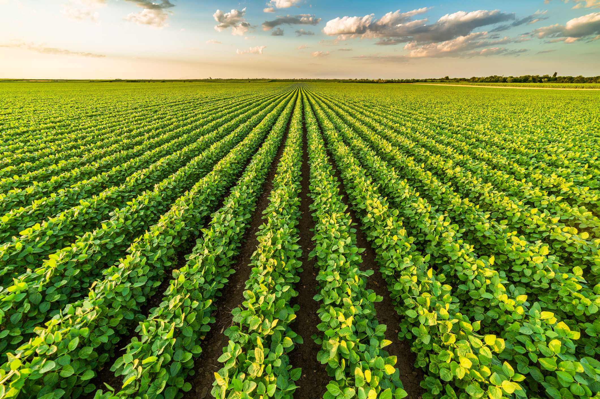

# FIAP - Inteligência Artificial
## Cap 1 - Play na sua carreira em IA

Projeto: FarmTech Solutions

* Culturas escohidas: Soja e Cana de Açucar

1. Soja

A soja é o principal produto da agricultura brasileira.
O Brasil representa cerca de 50% do comércio mundial de soja. E a região Centro-Oeste é a segunda maior produtora de soja do Brasil.

**Espaçamento entre plantas**:
1. A distância entre plantas na linha pode variar de 5 a 16 cm. 
2. O espaçamento entre linhas de uma lavoura de soja é recomendado de 40 a 60 cm.

**Escolhas do grupo**:

* Tipo de figura geométrica: Retângulo
* Produto para o plantio: Água, 620mm (milímetros) por planta
  * 1 mm = 1L/m2
  * 620mm = 620L/m2
* Distância entre as plantas: 10 cm ou 0.1m
* Espaço entre as linhas das lavoura: 50cm ou 0.5m

